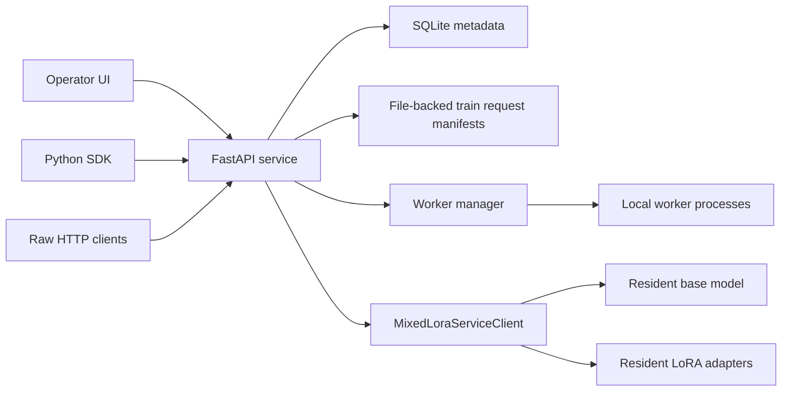

# Copyright (c) 2025, NVIDIA CORPORATION.  All rights reserved.
#
# Licensed under the Apache License, Version 2.0 (the "License");
# you may not use this file except in compliance with the License.
# You may obtain a copy of the License at
#
#     http://www.apache.org/licenses/LICENSE-2.0
#
# Unless required by applicable law or agreed to in writing, software
# distributed under the License is distributed on an "AS IS" BASIS,
# WITHOUT WARRANTIES OR CONDITIONS OF ANY KIND, either express or implied.
# See the License for the specific language governing permissions and
# limitations under the License.

# Nemotron-Tinker Architecture

Nemotron-Tinker is an experimental Tinker-style service for training and serving
many LoRA adapters over one resident base model. The current implementation is
single-node first: keep the base model hot on one GPU host, create separate
resident LoRA runs, route each request row to the right adapter, and expose the
workflow through HTTP, a small Python SDK, and the Nemotron Tinker operator UI.

## Control Plane



The API owns run metadata, tenant scoping, idempotency, async job records,
worker placement, rate limits, and request validation. Large train requests are
stored as manifest files under scratch instead of being copied into SQLite.

Important files:

- `src/nemotron_tinker/server.py`: FastAPI service, job control,
  metadata, tenants, and NeMo-RL bridge.
- `src/nemotron_tinker/mixed_client.py`: resident model path,
  LoRA routing, losses, sampling, and save/restore.
- `src/nemotron_tinker/worker_manager.py`: local process
  supervision and management RPC.
- `src/nemotron_tinker/operator_ui.html`: Nemotron Tinker UI.
- `src/nemotron_tinker/sdk.py`: Python client wrapper.
- `src/nemotron_tinker/grouped_lora_kernel.py`: experimental
  grouped Triton LoRA kernels.

## Data Plane

Each run represents one adapter over the shared base model. A batch can contain
rows for many runs. The service groups rows by adapter, executes the base model
once per microbatch path, applies the selected LoRA weights, computes the
requested loss, and accumulates gradients into the matching adapter.

Supported loss names:

- `cross_entropy` for SFT.
- `importance_sampling`, `ppo`, `cispo`, and `dro` for RL-style LoRA updates.

The preferred SFT and RL entry point is `POST /train_steps`, because the server
owns microbatching, optimizer steps, saves, async progress, cancellation, and
compact job records. Lower-level endpoints such as `/mixed_forward_backward`
and `/runs/{run_id}/optim_step` remain useful for debugging and parity tests.

## Worker Model

Worker processes are present today for supervision, placement bookkeeping, and
management RPC. V1 still executes real model operations in the API process. The
next production step is to move create/train/sample/save envelopes fully into
worker processes so the API becomes a thin durable control plane.

Current worker capabilities:

- Worker registry and health checks.
- Durable run placement.
- Restart reconciliation for resident runs.
- Management RPC for ping, echo, run listing, and operation listing.
- Worker readiness surfaced through `/health`.

Current worker limits:

- Worker death does not yet automatically rehydrate assigned adapters.
- Model execution is not isolated from the API process.
- Multi-process execution is local-node only.

## Storage

Default scratch layout:

```text
$SCRATCH/tinker_api/metadata.sqlite3
$SCRATCH/tinker_api/train_requests/
$SCRATCH/tinker_api/rl_logs/
$SCRATCH/checkpoints/
```

For GPU runs, use `/tmp/nemotron_tinker` as scratch and cache large model
artifacts under `/tmp/nemotron_tinker_hf`.

## Distributed Scope

The prototype is single-node. It can run large local models when the model fits
on the host, but it does not yet orchestrate multi-node rendezvous, rank
placement, Slurm, Ray, or a distributed worker fleet.

Expected production directions:

- Use AutoModel-native distributed loading for supported targets.
- Keep the Tinker API as the resident adapter control plane.
- Add real worker execution and restart recovery before multi-host scheduling.
- Use Megatron Bridge or NeMo-RL when the job is a large dedicated distributed
  training run instead of an interactive multi-adapter service.

## Kernel Scope

No custom kernel changes are required for the current prototype. The default
`grouped` backend is the practical path for now. `grouped_triton` is correct in
tests but slower today, because some reductions still fall back to PyTorch.

Production mixed-adapter throughput likely needs kernel work:

- Batch adapter rows together instead of launching per adapter range.
- Move dA/dB LoRA gradient reductions into segmented Triton or CUDA kernels.
- Fuse routing, low-rank projections, and accumulation where it reduces launch
  overhead.
- Revisit expert-parallel and tensor-parallel interactions for MoE bases.
